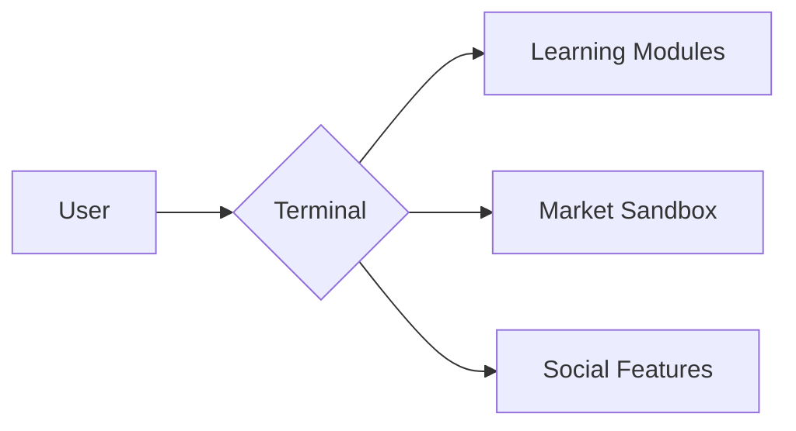

# GÖDEL TERMINAL - NEXT GEN TRADING SIMULATOR

## CORE VISION
"Learn markets by playing markets" - A risk-free environment where beginners:
- Experience market mechanics through gameplay
- Learn through historical scenarios
- Develop intuition via visual feedback

## KEY UX PILLARS
1. **Gamified Learning**
   - Achievements for learning milestones
   - Scenario-based challenges
   - Virtual currency rewards

2. **Beginner-Friendly UI**
   - Context-sensitive help
   - Interactive tutorials
   - Visual command builder

3. **Emotional Engagement**
   - Market mood indicators
   - Celebratory animations
   - Progress storytelling

## IMPROVED ARCHITECTURE


## ROADMAP
### Onboarding Phase
- [ ] Interactive walkthrough
- [ ] Paper trading mode
- [ ] Bite-sized lessons

### Core Experience
- [ ] Emotional feedback system
- [ ] Risk/reward visualizer
- [ ] Historical time travel

### Advanced Features
- [ ] Multiplayer competitions
- [ ] Portfolio storytelling
- [ ] AI trading coach

## DEVELOPMENT GUIDELINES
- TypeScript for type safety
- Functional components
- Modular architecture
- Comprehensive docs

## API DOCUMENTATION

### Core Endpoints
- `/api/market` - Market data simulation
- `/api/portfolio` - Portfolio management
- `/api/scenarios` - Historical events

### Authentication
```typescript
interface Auth {
  token: string;
  expires: Date;
}
```

## PLUGIN SYSTEM
1. **Structure**
   - Each plugin in `/plugins` folder
   - Must implement `IPlugin` interface

2. **Example Plugin**
```typescript
interface IPlugin {
  name: string;
  init: () => void;
}
```

## TESTING GUIDELINES
1. Unit Tests:
   ```bash
   npm test:unit
   ```
2. Integration Tests:
   ```bash
   npm test:integration
   ```

## DEPLOYMENT
1. Production:
   ```bash
   npm run build && npm run deploy
   ```
2. Development:
   ```bash
   npm run dev
   ```
